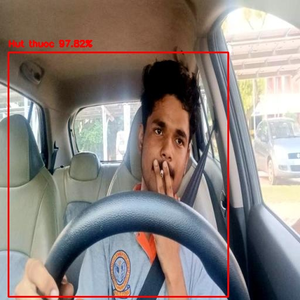
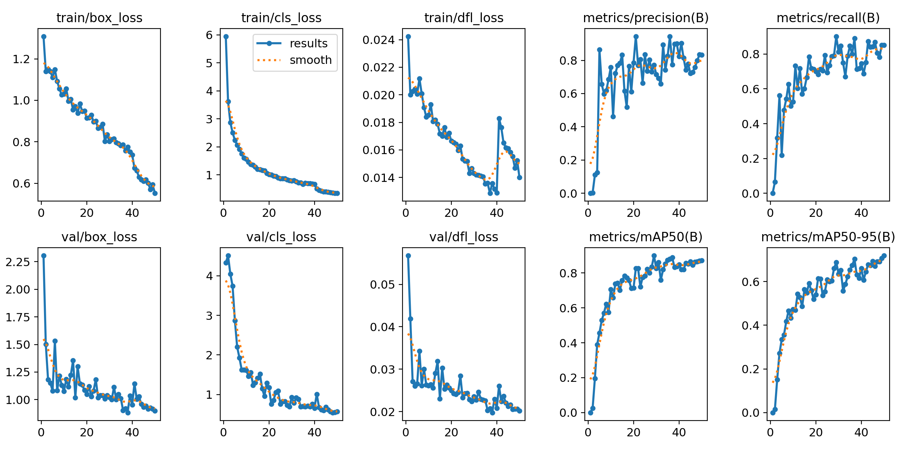
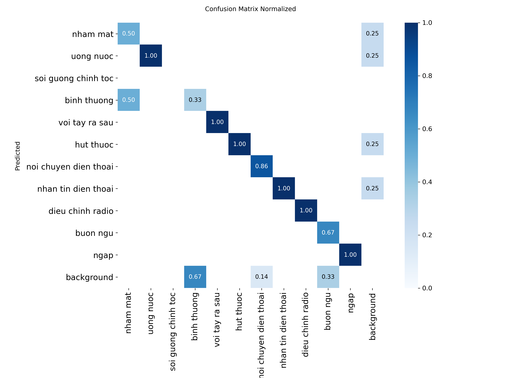

# Driver Behavior Detection — YOLO26


Phát hiện **11 hành vi nguy hiểm của tài xế** trong khi lái xe sử dụng mô hình **YOLO26**, huấn luyện trên Google Colab với custom augmentation. Web app demo xây dựng bằng **Flask**.

---

## Demo

<!-- Thêm ảnh kết quả sau khi có -->


**Chạy web app local:** `python app.py` → mở `http://localhost:5000`

---

## Kết quả mô hình

| Training Curves | Confusion Matrix |
|:---:|:---:|
|  |  |


---

## 11 Hành vi được phát hiện

| ID | Hành vi | Mức độ nguy hiểm |
|----|---------|-----------------|
| 0 | Nhắm mắt | 🔴 Rất nguy hiểm |
| 1 | Uống nước | 🟡 Trung bình |
| 2 | Soi gương chỉnh tóc | 🟡 Trung bình |
| 3 | Bình thường | 🟢 An toàn |
| 4 | Với tay ra sau | 🔴 Nguy hiểm |
| 5 | Hút thuốc | 🟡 Trung bình |
| 6 | Nói chuyện điện thoại | 🔴 Nguy hiểm |
| 7 | Nhắn tin điện thoại | 🔴 Rất nguy hiểm |
| 8 | Điều chỉnh radio | 🟡 Trung bình |
| 9 | Buồn ngủ | 🔴 Rất nguy hiểm |
| 10 | Ngáp | 🟡 Trung bình |

---


---

## Dataset

| | |
|---|---|
| **Nguồn** | Driver Monitoring Dataset (https://www.kaggle.com/datasets/moh3we5/driver-monitoring/data) |
| **Số class** | 11 hành vi tài xế |
| **Format** | YOLO (txt labels) |
| **Augmentation** | Brightness, Blur, Noise, Horizontal Flip (custom) |

---

## Pipeline huấn luyện (Google Colab)

| Bước | Nội dung |
|------|---------|
| 1 | Kết nối Google Drive, kiểm tra GPU |
| 2 | Cài đặt Ultralytics, TensorRT |
| 3 | Custom augmentation (Brightness, Blur, Noise, Flip) |
| 4 | Map tên class Anh → Việt |
| 5 | Huấn luyện YOLO26n — 50 epochs, batch 32, AdamW |
| 6 | Vẽ training curves (Box/Cls/DFL loss) |
| 7 | Đánh giá trên tập test |
| 8 | Inference ảnh mẫu từ test set |
| 9 | Export TensorRT FP16 |

---

## Tham số huấn luyện

| Tham số | Giá trị |
|---------|---------|
| Model | `yolo26n.pt` |
| Epochs | 50 |
| Image size | 640 × 640 |
| Batch size | 32 |
| Optimizer | AdamW |
| Learning rate | 0.001 |
| Device | Google Colab GPU |
| Augmentation | Custom callback |

---

## 🛠️ Cài đặt & chạy

```bash
# Clone repo
git clone https://github.com/Namvipcf/driver-behavior-yolo26.git

# Cài thư viện
pip install -r requirements.txt

# Chạy web app (cần best.pt trong thư mục weights/)
python app.py
```

Mở trình duyệt tại `http://localhost:5000`


---

## Tính năng Web App

- Upload ảnh (JPG, PNG) → phát hiện hành vi + vẽ bounding box
- Hiển thị tên hành vi + confidence score
- Phân loại màu: 🟢 An toàn / 🔴 Nguy hiểm
- API endpoint `/api/stats` trả về thống kê

---


---

## Môi trường huấn luyện

| | |
|---|---|
| Platform | Google Colab |
| Framework | Ultralytics YOLO26 |
| Export | TensorRT FP16, ONNX |
| Web | Flask 3.0 |

---

## License

MIT License — xem [LICENSE](LICENSE)

---

## 👤 Tác giả

**Nguyễn Văn Bắc**
- GitHub: (https://github.com/Namvipcf)
- Email: nguyenbac813110@gmail.com
